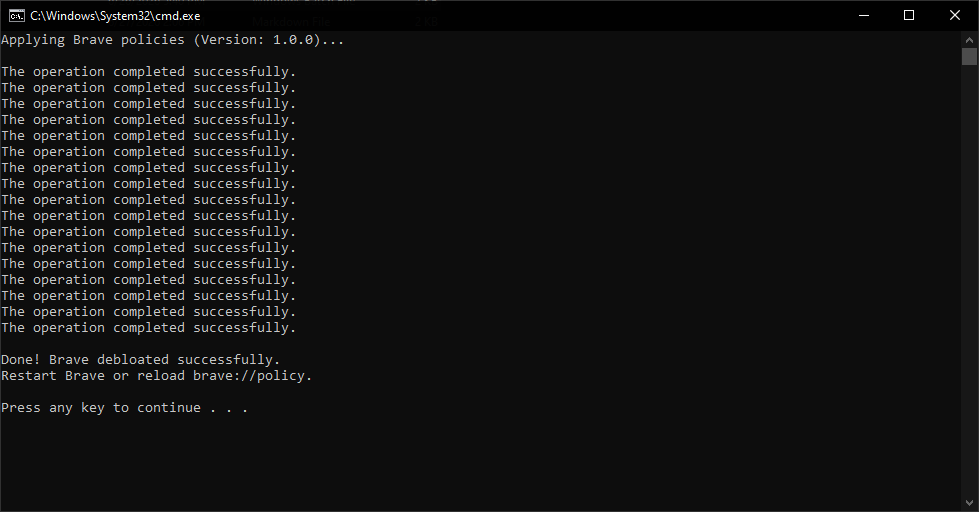

# Brave Debloater

A lightweight Windows batch script to debloat the Brave Browser by applying enterprise policies. This script turns off unnecessary features, disables telemetry/data collection, and enforces better privacy settings directly via the Windows Registry.

## Version
Current Version: **1.0.0**

## Features Disabled/Modified

When run, this script applies the following policies to Brave:
- **Core Bloatware Disabled**: Brave Rewards, Brave Wallet, Brave VPN, Brave News, and Brave Talk.
- **Telemetry & Data Collection Disabled**: Stats Ping, URL-Keyed Anonymized Data Collection, Safe Browsing Extended Reporting, Feedback Surveys, Brave Web Discovery, Brave P3A, and Metrics Reporting.
- **Background Mode**: Prevents Brave from running in the background when closed.
- **Built-in Managers Disabled**: Disables the built-in Password Manager, Autofill for Addresses, and Autofill for Credit Cards (useful if you use a dedicated third-party password manager).
- **Download Behavior**: Forces Brave to always prompt for a download location before downloading a file.

## Usage

> [!IMPORTANT]
> The script modifies the Windows Registry. It will automatically request Administrator privileges when launched.

1. Run `brave-debloater.bat`. (If prompted by User Account Control, click Yes to allow Administrator access).
2. Open Brave and go to `brave://policy` to verify that the policies have been applied.

## Privacy Tip: Installer Referral Tracking

> [!TIP]
> **Rename the Brave installer before running it!**
> 
> When you download Brave, the filename often contains an alphanumeric tracking code (e.g., `BraveBrowserSetup-BRV010.exe`). This is a **referral code** used by Brave for telemetry to track the source of your download (e.g., from a specific ad campaign or affiliate link), which is extracted by the browser on its first launch.
> 
> To completely opt-out of this initial telemetry ping, simply rename the installer file to something generic (like `BraveSetup.exe`) *before* you run it.

## Notes

- Because these are applied as administrative policies, some settings in Brave's UI will show as "Managed by your organization" and cannot be toggled manually by a standard user.
- To revert these changes, you will need to manually delete the `HKLM\SOFTWARE\Policies\BraveSoftware\Brave` key from the Registry Editor (`regedit`).

## Screenshot

