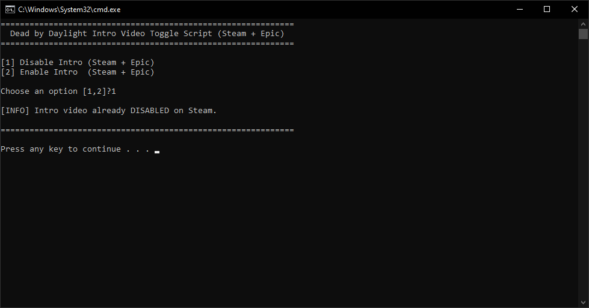

# DBD Intro Toggler

A fast batch script to easily disable or enable the intro video for Dead by Daylight across both Steam and Epic Games Store installations.

## Version
Current Version: **1.0.0**

## Overview
Dead by Daylight forces an unskippable cinematic intro video every time you launch the game. This script automatically scans your PC for the game's installation directory across your Steam Libraries and Epic Games Library, and renames the `LoadingScreenPostLogin.bk2` video file to safely bypass it, getting you to the main menu faster. 

## Features
- **Auto-Detection**: Automatically parses Steam's `libraryfolders.vdf` and Epic Games Store's manifests to locate the game without requiring you to manually type out paths.
- **Dual-Store Support**: Detects and processes both Steam and Epic Games installations simultaneously if you have both.
- **Safe Reversal**: Provides a simple toggle to enable the intro again (useful when the game updates, as patches often restore the video file).

## Usage
1. Run `dbd-intro-toggler.bat`.
2. The script will request Administrator privileges.
3. It will scan for the game installations and present a menu.
4. Press `1` to Disable the intro, or `2` to Enable it.

## Screenshot

