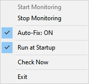

# Display Mode Fixer

An AutoHotkey v2 script that monitors your Windows display projection mode and automatically switches it to "Second screen only" to prevent performance issues.

## Version
Current Version: **1.0.0**

## Overview
When a TV or secondary display is plugged in but not actively being used, leaving the Windows projection mode in "Extend" or "Duplicate" can cause unexpected lagging or hanging while gaming on the primary monitor. This script runs silently in the system tray, monitors the display mode, and automatically forces it into single-display mode to ensure optimal gaming performance.

## Usage
1. You must have [AutoHotkey v2](https://www.autohotkey.com/) installed on your system.
2. Double-click `display-mode-fixer.ahk` to run it.
3. The script will sit quietly in your system tray (look for the monitor icon).
4. **Features**:
   - Right-click the tray icon to start/stop monitoring.
   - Toggle the "Auto-Fix" behavior on or off.
   - Enable "Run at Startup" directly from the tray menu so you never forget to launch it before gaming.

## Screenshot

