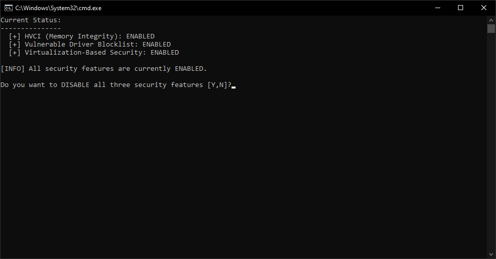

# HVCI Toggler

A powerful batch script to easily toggle Windows Virtualization-Based Security (VBS), Hypervisor-Enforced Code Integrity (HVCI / Memory Integrity), and the Microsoft Vulnerable Driver Blocklist on or off.

## Version
Current Version: **1.0.0**

## Overview
Windows 11 enables these security features by default, which can sometimes interfere with virtualization software, debugging tools, or older hardware drivers, and can cause a minor performance hit in some gaming scenarios. This script checks the status of these three features and allows you to toggle them all off or on simultaneously with a single key press.

## Usage

1. Run `hvci-toggler.bat`.
2. The script will automatically request Administrator privileges via UAC.
3. It will display the current status of:
   - HVCI (Memory Integrity)
   - Vulnerable Driver Blocklist
   - Virtualization-Based Security
4. It will prompt you with a `Y/N` choice to either enable or disable them based on their current state.
5. Press `Y` to confirm. 

> [!WARNING]
> Because these settings modify core kernel and hypervisor configurations in the Windows Registry (`HKLM\SYSTEM\CurrentControlSet\Control\DeviceGuard`), **you must reboot your computer** after running this script for the changes to take effect. Disabling these features reduces system security against malicious drivers and kernel-level exploits. Use with caution.

## Screenshot

