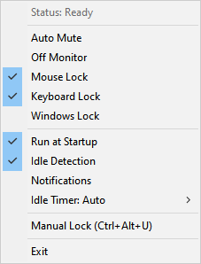

# Idle Locker

A highly configurable AutoHotkey v2 script that monitors your system for inactivity, automatically locks your Windows session, mutes system volume, and disables mouse/keyboard inputs to prevent accidental wake-ups (like cats walking on keyboards) when your monitor is turned off.

## Version
Current Version: **1.0.0**

## Features
- **Input Blocking**: Disables mouse movement and keyboard typing when the monitor is off to prevent accidental wake-ups.
- **Auto-Mute**: Optionally mutes your system audio when the display turns off so you aren't startled by notifications.
- **Smart Detection**: Automatically syncs with your Windows Power Settings to detect your configured monitor timeout duration.
- **Configurable**: Contains a dedicated configuration block at the top of the file to easily toggle features on or off.
- **Bonus Feature**: Press `Ctrl+Alt+T` on any active window to instantly toggle its "Always on Top" status!

## Setup & Usage
1. You must have [AutoHotkey v2](https://www.autohotkey.com/) installed on your system.
2. Double-click `idle-locker.ahk` to run it.
3. It will automatically request Administrator privileges (required to block low-level system input).
4. The script will sit quietly in your system tray.
5. **Configuration Options**:
   - **File Defaults**: You can permanently change the default startup settings by opening `idle-locker.ahk` in a text editor and modifying the variables inside the `===== CONFIGURATION =====` block.
   - **Tray Menu**: Right-click the script's icon in your system tray to access a convenient menu where you can instantly toggle features on the fly, such as Auto Mute, Mouse Lock, and Keyboard Lock.
   - **Manual Lock**: Trigger a manual lock instantly by pressing `Ctrl+Alt+U`.

## Screenshot

