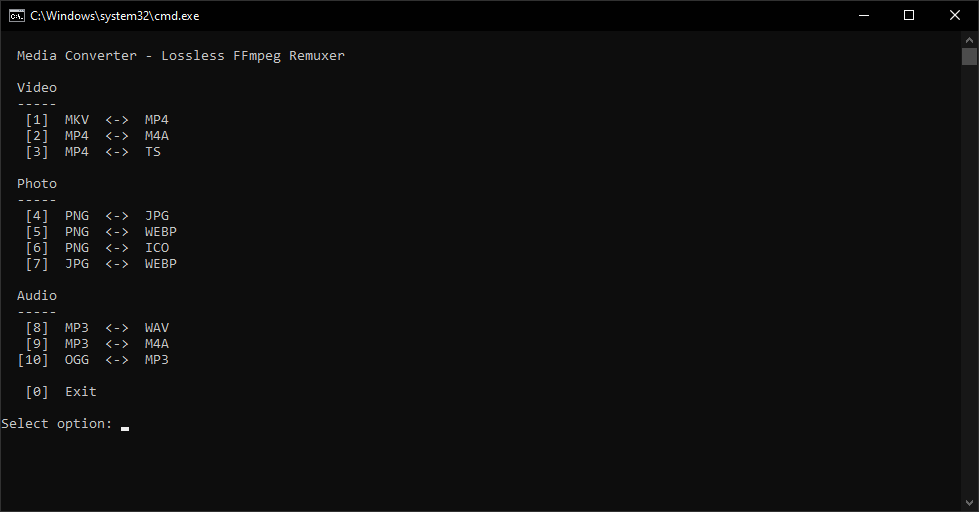

# Media Converter

A quick and easy batch script wrapped around FFmpeg to perform lossless remuxing of video files between different container formats (e.g., MKV to MP4) without re-encoding the video or audio streams.

## Version
Current Version: **1.0.0**

## Dependencies
You must have **FFmpeg** installed and added to your system's PATH. 
- You can install it easily via Windows Package Manager: `winget install ffmpeg`

## Usage
1. Place the `media-converter.bat` script into the directory containing the video files you want to convert.
2. Double-click the script to run it.
3. The script will present an interactive menu allowing you to choose the conversion direction (e.g., `MKV -> MP4`, `MP4 -> MKV`, `FLV -> MP4`, etc.).
4. FFmpeg will rapidly strip the video and audio streams out of the old container and place them into the new container losslessly.
5. All original files are preserved.

## Credits
This script serves as an automated GUI-less wrapper for the incredible [FFmpeg](https://ffmpeg.org/) multimedia framework. All remuxing and video processing is handled entirely by their software.

## Screenshot

