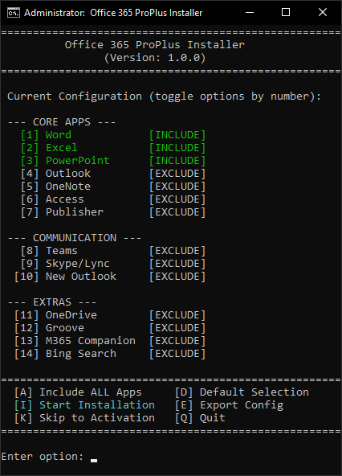

# Office 365 ProPlus Installer

This directory contains an interactive, automated batch script to download and install Office 365 ProPlus using the official Microsoft Office Deployment Tool (ODT).

## Version
Current Version: **1.3.0**

## Overview

The `office-installer.bat` script is an advanced, interactive installer designed to give you fine-grained control over your Office installation. It allows you to save space and reduce bloat by letting you choose exactly which applications to install.

### Key Features
- **Default Minimal Setup**: By default, the script is pre-configured to install only **Word**, **PowerPoint**, and **Excel** to save space.
- **Interactive Menu**: Upon launching, a command-line menu allows you to toggle which Office apps to install or exclude (e.g., to add Publisher or Access back in).
- **Automated ODT Download**: Automatically fetches the necessary Office Deployment Tool from Microsoft.
- **Desktop Shortcuts**: Optionally creates desktop shortcuts for all installed applications automatically.
- **Auto-Cleanup**: Cleans up the residual installation files and XML configurations once the setup is complete.

## Usage

> [!IMPORTANT]
> The script requires Administrator privileges to run and install software on your machine. It is configured to self-elevate and will prompt you automatically via User Account Control (UAC).

1. Double-click `office-installer.bat` (or right-click and select **Run as administrator**).
2. Follow the on-screen menu instructions to toggle your desired applications using the number keys.
3. Once configured, press `I` to start the installation.
4. Wait for the Office deployment to complete.

## Credits & Acknowledgements

- **[Microsoft Office Deployment Tool (ODT)](https://www.microsoft.com/en-us/download/details.aspx?id=49117)**: Used for downloading and deploying the Office packages.
- **[Microsoft Activation Scripts (MAS)](https://github.com/massgravel/Microsoft-Activation-Scripts)**: Used for the activation of the Office installation.

## Screenshot

